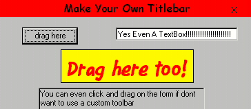



## Beginners\*\* Move\-form no caption and make your own custom titlebar

### Description

this coding simply is for beginners and allows you to move your form without a titlebar, or with you own custom titlebar!!!
 
### More Info
 

             |
---                |---
**Submitted On**   |2000-04-21 15:21:02
**By**             |[AdamSpicer](https://github.com/Planet-Source-Code/PSCIndex/blob/master/ByAuthor/adamspicer.md)
**Level**          |Beginner
**User Rating**    |5.0 (25 globes from 5 users)
**Compatibility**  |VB 5\.0, VB 6\.0
**Category**       |[Custom Controls/ Forms/  Menus](https://github.com/Planet-Source-Code/PSCIndex/blob/master/ByCategory/custom-controls-forms-menus__1-4.md)
**World**          |[Visual Basic](https://github.com/Planet-Source-Code/PSCIndex/blob/master/ByWorld/visual-basic.md)
**Archive File**   |[CODE\_UPLOAD50384212000\.zip](https://github.com/Planet-Source-Code/adamspicer-beginners-move-form-no-caption-and-make-your-own-custom-titlebar__1-7463/archive/master.zip)

